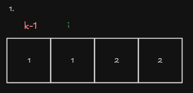
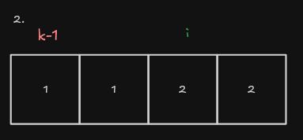
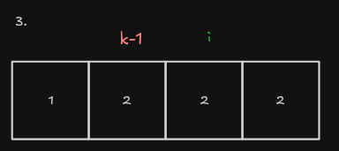
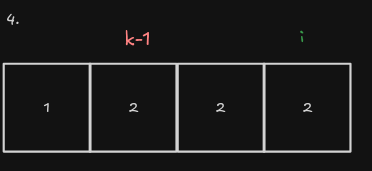

# 26. Remove Duplicates from Sorted Array

## Enunciado

Given an integer array `nums` sorted in non-decreasing order, remove the duplicates in-place such that each unique element appears only once. The relative order of the elements should be kept the same.

Consider the number of unique elements in `nums` to be `k`​​​​​​​​​​​​​​. After removing duplicates, return the number of unique elements `k`.

The first `k` elements of `nums` should contain the unique numbers in sorted order. The remaining elements beyond index `k-1` can be ignored.

## Exemplos

```
Input: nums = [1,1,2]
Output: 2, nums = [1,2,_]
```


**Explanation:** Your function should return `k = 2`, with the first two elements of nums being `1` and `2` respectively.
It does not matter what you leave beyond the returned `k` (hence they are underscores).

# Resolução

## Ideia principal do algoritmo

- `v` é o vetor, uma lista de números inteiros ordenados na ordem crescente.

- `n` considere como um número inteiro que representa o tamanho do vetor.

- `k` considere como um número inteiro que representa tamanho de um subvetor de `v`, inicialmente ele começa com o valor `1`.

Iteramos sob cada valor do vetor principal através do indice `i`, um número inteiro pertencente que representa o índice de `v`. Os passos internos da iteração serão:


1. Enquanto `v[k-1] != v[i]` for verdade, o tamanho `k` do subvetor de `v` aumenta e o valor presente em `v[k-1]` será igual ao valor de `v[i]`; Como o subvetor é na verdade o próprio vetor principal não sendo uma nova estrutura, podemos inverter a lógica: o valor presente em `v[k]` será igual a `v[i]` e o tamanho `k`aumenta.

2. Enquanto `v[k-1] != v[i]` for falso, a iteração continua incrementando o índice i.


### Intuição Visual




